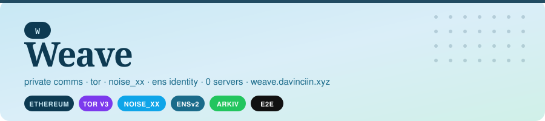
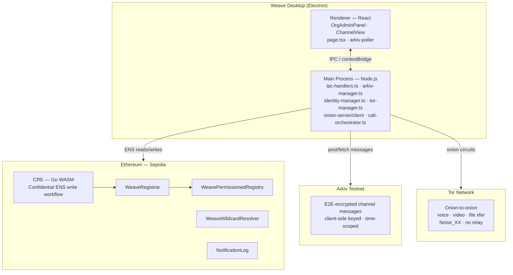

<p align="center">
  
</p>

<p align="center">
  <strong>🌐 <a href="https://weave.davinciin.xyz">weave.davinciin.xyz</a></strong> &nbsp;·&nbsp;
  <a href="https://github.com/Philotheephilix/weave/releases/tag/v0.1.0">⬇ Download for Mac</a> &nbsp;·&nbsp;
  <a href="https://sepolia.etherscan.io">Contracts on Sepolia</a>
</p>

<br/>

**Decentralized, privacy-first collaboration for teams, orgs, and DAOs — full Microsoft Teams feature parity, zero surveillance surface.**

---

## The Problem

### Enterprise comms is a surveillance monopoly

| Platform | Revenue / Scale | What they see |
|---|---|---|
| Microsoft Teams | ~$13.5B est. 2024, 320M MAU | All chats (incl. deleted), meeting metadata, app usage, IPs, webcam state — logged by default, no consent step |
| Slack Enterprise | ~$45/user/month list, $150K–$300K/year typical contract | Message graph, sender/recipient/timestamps reachable by court order; content by warrant |

A 10,000-seat Teams deployment costs **$630K/year** in licensing alone — for a product that hands your communication graph to any government that asks.

### DAOs and Web3 orgs are even more exposed

- **Sushi DAO (2023)** — SEC subpoenaed the DAO and its CEO. They coordinated on Discord.
- **SpartacusDAO (2023)** — Lawsuit served *via Discord*. $35M freeze upheld. Discord accepted legal service.
- **Path Network (2023)** — US court subpoenaed Discord account data and login history. Discord complied.

Discord and Telegram usernames trivially link to on-chain wallet addresses. One subpoena surfaces the entire coordination graph of a DeFi team.

### The root cause

Every platform routes through a relay that sees both sides. Even E2E-encrypted apps log *who talks to whom, when, and how often*. That metadata is the graph. The graph is the liability.

---

## The Solution

Weave is a decentralized collaboration platform where:

- **No IP is ever exposed to any server** — both endpoints are Tor v3 onion services; no STUN, no TURN, no ICE relay
- **All content is end-to-end encrypted** — Noise_XX (X25519 + ChaCha20-Poly1305) on every connection
- **No communication graph exists** — ERC-5564 stealth addresses, one-time keys per session
- **No relay sees routing metadata** — BitTorrent DHT for peer discovery, direct onion-to-onion connections
- **Identity is on-chain, not vendor-owned** — ENSv2 `*.weave.eth` subnames on Ethereum; roles and permissions in the EAC bitmap
- **Messages are stored on Arkiv** — decentralized data layer on Ethereum; time-scoped, content-addressed, E2E encrypted before storage

---

## Architecture



### Identity layer — ENSv2 + EAC

Every user, org, and member is an ENSv2 subname:

```
alice.weave.eth          ← individual identity
acme.weave.eth           ← org
bob.acme.weave.eth       ← member of acme
```

Text records on each name store: stealth view/spend keys, X25519 noise pubkey, Tor onion address, Nostr pubkey.

**EAC role bitmap** (256-bit, 64 nybbles) — org permissions entirely on-chain:

| Nybble | Role | Bit value |
|---|---|---|
| 0 | REGISTRAR | `0x1` |
| 1 | MODERATOR | `0x10` |
| 2 | PUBLISHER | `0x100` |
| 3 | VIEWER | `0x1000` |
| 4 | AUDITOR | `0x10000` |
| 5 | BOT | `0x100000` |
| 6 | GUEST | `0x1000000` |
| 7 | BILLING | `0x10000000` |
| 16–63 | Org-defined custom roles | via WeaveRoleRegistry |

No Slack admin panel. No vendor IAM. Roles are auditable on-chain and revocable in one transaction.

### Transport layer — Tor + Noise_XX

```
Alice (onion service A)  ──Noise_XX──►  Bob (onion service B)
         ↑                                        ↑
   ephemeral .onion                        ephemeral .onion
   no IP leakage                           no IP leakage
```

Noise_XX: X25519 key exchange → ChaCha20-Poly1305 AEAD → HKDF-SHA256. No TLS, no OpenSSL.

### Message storage — Arkiv

Channel messages are encrypted client-side with a per-channel symmetric key (rotated on membership change), then posted to Arkiv. The network stores ciphertext only. Key versions track rotations; old keys are preserved so prior messages remain readable by members who held them.

### CRE — Confidential ENS writes

ENS transactions (registerOrg, enrollMember, grantRole) are submitted through a **Go WASM workflow** (CRE) that keeps the signing key inside a confidential execution environment. The frontend never touches the raw private key for on-chain writes.

---

## Contracts (Sepolia)

| Contract | Address |
|---|---|
| WeavePermissionedRegistry | `0x38E5F605bE16c4A54d0a1CF5A6E75DFF1679EFf3` |
| WeaveWildcardResolver | `0xE324fB0Fb00621094B8e81EA71E28D4263445377` |
| WeaveRegistrar | `0x47f73c5F82a43Cc4b3a007131Af0E84543146950` |
| NotificationLog | `0x8106E27a1FDE848Bf7A41fE90207A0e4Aa0dE849` |

Explorer: [sepolia.etherscan.io](https://sepolia.etherscan.io)

---

## Feature Parity

| Feature | Teams/Slack | Weave |
|---|---|---|
| Channels + teams | ✓ | ✓ |
| Direct messages | ✓ | ✓ (Tor + Arkiv) |
| Voice / video calls | ✓ | ✓ (onion-to-onion, no relay) |
| File sharing | ✓ | ✓ (IPFS, client-side encrypted) |
| Role-based access | ✓ (vendor DB) | ✓ (on-chain EAC bitmap) |
| Custom org roles | ✓ (vendor DB) | ✓ (WeaveRoleRegistry) |
| Admin panel | ✓ | ✓ (OrgAdminPanel) |
| IP hidden from relay | ✗ | ✓ |
| Communication graph | logged | destroyed |
| Vendor lock-in | full | zero |
| Subpoenable | yes | no relay to subpoena |

---

## Market

- Enterprise collaboration software: **$52–102B (2024)** → $160–261B by 2034
- DAO tooling: $170M (2024) → $333M (2032) at 18% CAGR
- Every MNC, DAO, legal firm, journalist network, and DeFi protocol that has ever paid a Slack invoice is the target market

---

## Repo Layout

```
weave/
├── app/               Electron desktop app (main + renderer)
│   ├── main/          Node.js main process: IPC, Tor, Arkiv, crypto
│   └── renderer/      React renderer: UI components, ENS helpers, poller
├── contracts/         Solidity (Foundry) — ENS registry + role system
├── cre-workflow/      Go WASM confidential ENS write workflow
├── docs/              Architecture docs, feature specs
└── landing/           Landing page — weave.davinciin.xyz
```

See [`CLAUDE.md`](./CLAUDE.md) for full navigation guide, IPC pattern, and dev workflow.

---

## Quick Start

```bash
# Contracts
cd contracts && forge build && forge test

# App
cd app && npm install && npm run dev
```

Requires: Node 20+, Foundry, Go 1.21+ (for CRE WASM build), Tor daemon.
